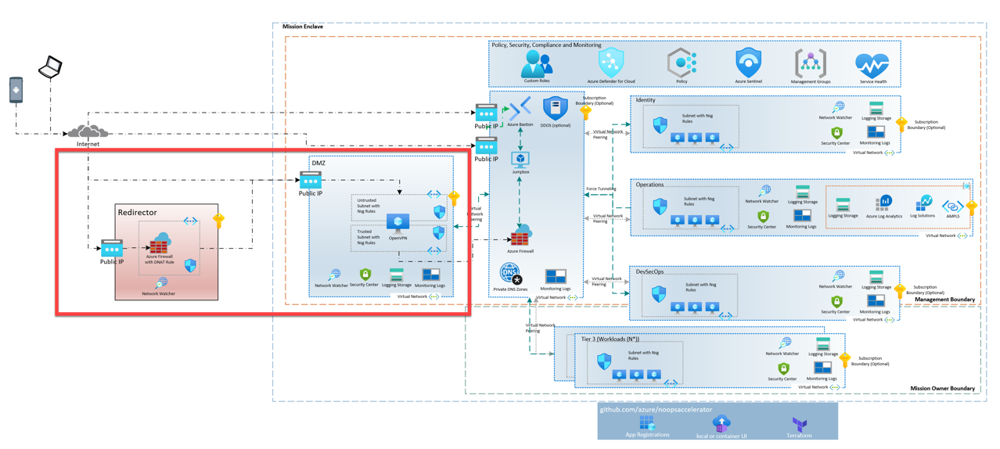

# Encrypted Transport for SCCA-Compliant Enclave Reference Add-on Starter

The Encrypted Transport for SCCA-Compliant Enclave Reference Add-on Starter Terraform module provides an opinionated approach for deploying and managing the core platform capabilities of encrypted transport (Obfuscation) for SCCA-compliant enclaves using Terraform, with a focus on the central resource hierarchy.

## Architecture

The following diagram shows the overall solution architecture for the Encrypted Transport Add-on. The main components are the DMZ Spoke and one or more Redirectors. The DMZ Spoke is deployed into the same region as the Hub and the Redirectors are deployed into an Azure Commercial region that is geographically close to the end users / VPN users. This placement ensures that the user's traffic is routed over Azure-owned fiber back to the Hub region, which reduces overall latency. The Redirectors are deployed into a separate resource group and virtual network to ensure that the traffic is isolated from other resources in the region. The Redirectors are also deployed into a separate subnet to ensure that the traffic is isolated from other resources in the virtual network.

## Design areas

The Encrypted Transport for SCCA-Compliant Enclave Reference Add-on Starter Terraform module is designed to address the following areas:

[Resource organization](https://learn.microsoft.com/azure/cloud-adoption-framework/ready/landing-zone/design-area/resource-org)

- Create a management group hierarchy for the encrypted transport platform

[Identity and access management](https://learn.microsoft.com/azure/cloud-adoption-framework/ready/landing-zone/design-area/identity-access)

- Azure Active Directory tenant for the encrypted transport platform
