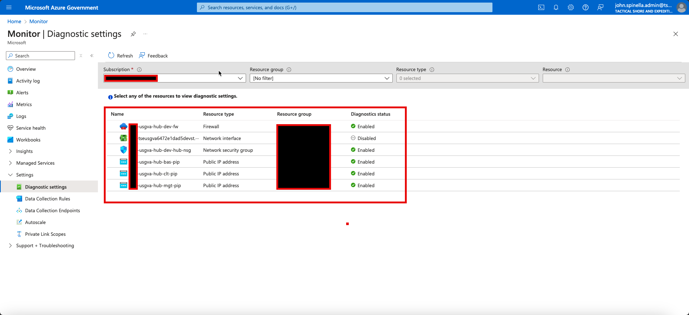

# Cleanup

Remember to destroy resources that are not in use. If you want to delete an Mission Enclave Landing Zone Starter deployment you can use [`terraform destroy`](https://www.terraform.io/docs/cli/commands/destroy.html). If you have deployed more than one Terraform template, e.g., if you have deployed `landing zone` and then `addon-workload`, run the `terraform destroy` commands in the reverse order that you applied them.

Delete in the specified bash below.

Ensure the following state management environment variables have been defined:

- STORAGEACCOUNTNAME = 'xxxxx'
- CONTAINERNAME      = 'xxxxx'
- TFSTATE_RG         = 'xxxxx'

```bash
# Deploy core MELZS resources
$STORAGEACCOUNTNAME='xxxxx'
$CONTAINERNAME='xxxxx'
$TFSTATE_RG='xxxxx'

terraform init --backend-config="resource_group_name=$TFSTATE_RG" --backend-config="storage_account_name=$STORAGEACCOUNTNAME" --backend-config="container_name=$CONTAINERNAME"

cd infrastructure/terraform
terraform apply --out anoa.dev.plan --var-file ../tfvars/parameters.tfvars --var "subscription_id_hub=<<subscription_id>>" --var "vm_admin_password=<<password>>"

# Destroy core MELZS resources
cd infrastructure/terraform
terraform plan --destroy -out anoa.dev.plan --var-file ../tfvars/parameters.tfvars -var "subscription_id_hub=<<subscription_id>>" --var "vm_admin_password=<<password>>"
terraform apply anoa.dev.plan
```

This command will attempt to remove all the resources that were created by `terraform apply` and could take up to 45 minutes.

# Misc Tasks

The Mission Enclave Landing Zone Starter when destoryed will leave behind some resources that need to be manually deleted.

## Diagnostic Settings

- Delete the diagnostic settings deployed at the subscription level.

> [!WARNING]
> If you deploy and delete Mission Landing Zone in the same subscription multiple times without deleting the subscription-level diagnostic settings, the sixth deployment will fail. Azure has a limit of five diagnostic settings per subscription. The error will be similar to this: `"The limit of 5 diagnostic settings was reached."`

To delete the diagnotic settings in script, use the AZ CLI or PowerShell. An AZ CLI example is below:

```BASH
# View diagnostic settings in the current subscription
az monitor diagnostic-settings subscription list --query value[] --output table

# Delete a diagnostic setting
az monitor diagnostic-settings subscription delete --name <diagnostic setting name>
```

### Using the Portal

Alternatively, you can delete the diagnostic settings from the Azure Portal. Choose the subscription blade, then Activity log in the left panel. At the top of the Activity log screen click the Diagnostics settings button. From there you can click the Edit setting link and delete the diagnostic setting.



## Defender for Cloud

- Delete the Defender for Cloud workspace deployed at the subscription level.

To downgrade the Microsoft Defender for Cloud pricing level in the Azure portal:

1. Navigate to the Microsoft Defender for Cloud page, then click the "Environment settings" tab in the left navigation panel.
1. In the tree/grid select the subscription you want to manage.
1. Click the large box near the top of the page that says "Enhanced security off".
1. Click the save button.

To downgrade the Microsoft Defender for Cloud pricing level using the AZ CLI:

```BASH
# List the pricing tiers
az security pricing list -o table --query "value[].{Name:name, Tier:pricingTier}"

# Change a pricing tier to the default free tier
az security pricing create --name "<name of tier>" --tier Free
```

> [!NOTE]
> The Azure portal allows changing all pricing tiers with a single setting, but the AZ CLI requires each setting to be managed individually.
