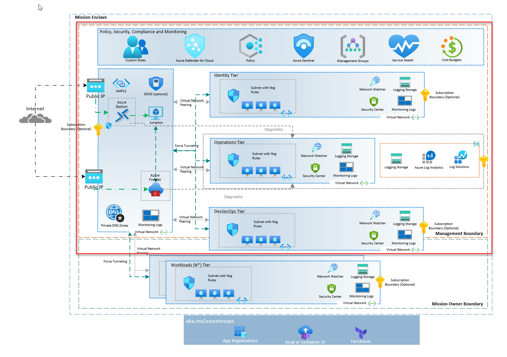

# Mission Enclave Policy Starter

The Mission Enclave Policy Starter Composition Terraform module provides an opinionated approach for deploying and managing the core platform capabilities of Azure Policy using Terraform, with a focus on the central resource hierarchy and Policy Driven Governance.

> Please refer to [Policy Driven Governance](https://learn.microsoft.com/en-gb/azure/cloud-adoption-framework/ready/landing-zone/design-principles#policy-driven-governance) for further information.

> **IMPORTANT NOTE:** Mission Enclave Policy Starter is to provide a secure, Zero Trust/SCCA aligned, and compliant environment. It is not a one-size-fits-all solution. It is a starting point that should be customized to meet the specific needs of your organization.

## Architecture

## Design areas

The Mission Enclave Policy Starter Terraform module is designed to address the following areas:

[Resource organization](https://learn.microsoft.com/azure/cloud-adoption-framework/ready/landing-zone/design-area/resource-org)

- Create custom Policy Assignments, Policy Definitions and Policy Set Definitions (Initiatives)

[Identity and access management](https://learn.microsoft.com/azure/cloud-adoption-framework/ready/landing-zone/design-area/identity-access)

- Secure the identity subscription using Azure Policy
