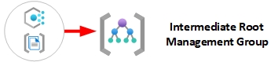

# Policy Governance

As part of a default deployment configuration, policy and policy set definitions are deployed at multiple levels within the Mission Enclave Management Group hierarchy as depicted within the below diagram.

The subsequent sections will provide a summary of policy sets and policy set definitions applied at each level of the Management Group hierarchy.

> **NOTE**: Although the below sections will define which policy definitions/sets are applied at specific scopes, please remember that policy will inherit within your management group hierarchy.

>  For convenience, an Excel version of the below information is available [here](./media/NoOps%20Policy%20Assignments%20v1.xlsx) or click the icon (last updated January 2024).

## Intermediate Root

This management group is a parent to all the other management groups created within the default Misson Enclave landing zone configuration. Policy assignment is predominantly focused on assignment of security and monitoring best practices to ensure compliance and reduced operational overhead.
  

| **Policy Type**           | **Count** |
| :---                      |   :---:   |
| `Policy Definition Sets`  | **13**     |
| `Policy Definitions`      | **0**     |

The table below provides the specific **Custom** and **Built-in** **policy definitions** and **policy definitions sets** assigned at the **Intermediate Root Management Group**.

| **Assignment Name** | **Policy Type** | **NIST Controls** | **Description** | **Effect(s)** |
| :--- | :--- | :--- | :--- | :--- |
| **General Governance** | `Policy Definition Set`, **Custom**   | N/A | This policy set configures all the General settings, such as Allowed Virtual Machine Sizes, Allowed Regions, and Not Allowed Resource Types | Modify
| **Security Governance** | `Policy Definition Set`, **Custom**   | AC-2 (12), AC-16, AU-6, AU-6 (4), AU-6 (5), AU-12, AU-12(1),CM-7, IR-4, IR-5, RA-5, SC-3, SI-2, SI-3, SI-3 (1), SI-4, SI-16 | This policy set configures all the MDFC settings, such as Microsoft Defender for Cloud per individual service, Security contacts, and export from MDFC to Log Analytics workspace | AuditIfNotExists,DeployIfNotExists
| **Monitoring Governance** | `Policy Definition Set`, **Custom**   | AU-6 (4), AU-6 (5), AU-12, AU-12 (1), SC-12, SI-4, | This policy set configures all the Azure Monitor settings, such as Activity Log, Diagnostic Settings for Azure Services, Workspace Retention, Azure Monitor Baseline Alerts for Service Health and DenyAction Delete on Activity Log Settings and Diagnostic Settings. | AuditIfNotExists,DeployIfNotExists
| **Identity and Access Management Governance** | `Policy Definition Set`, **Custom**   | IA-2 (1), IA-2 (2) | This policy set configures all the Identity and Access Management settings, such as Account management, Use private link to access Azure services | AuditIfNotExists,DeployIfNotExists
| **SQL Security Governance** | `Policy Definition Set`, **Custom**   | AC-2, AC-2 (1), AC-2 (7), AC-4, AU-11, IA-4, SC-28, SC-28 (1), CM-4,  | This policy set configures all the SQL Security settings, such as SQL Security Alert Policies, SQL Transparent Encryption and SQL Auditing Settings | AuditIfNotExists,DeployIfNotExists
| **Cost Management Governance** | `Policy Definition Set`, **Custom**   | N/A  | This policy set configures all the Cost Management settings, such as Budgets, and Audit Unused Resources | AuditIfNotExists,DeployIfNotExists
| **Configure Microsoft Defender for Databases to be enabled** | `Policy Definition Set`, **Built-In**   | AC-2 (12), AC-16, AU-6, AU-6 (4), AU-6 (5), AU-12, AU-12(1),CM-7, IR-4, IR-5, RA-5, SC-3, SI-2, SI-3, SI-3 (1), SI-4, SI-16  | This policy set configures Microsoft Defender for Databases to protect your Azure SQL Databases, Managed Instances, Open-source relational databases and Cosmos DB. | DeployIfNotExists
| **[Preview]: Deploy Microsoft Defender for Endpoint agent** | `Policy Definition Set`, **Built-In**   | AC-2 (12), AC-16, AU-6, AU-6 (4), AU-6 (5), AU-12, AU-12(1),CM-7, IR-4, IR-5, RA-5, SC-3, SI-2, SI-3, SI-3 (1), SI-4, SI-16  | This policy set deploys Microsoft Defender for Endpoint agent on applicable images. | DeployIfNotExists
| **Configure Advanced Threat Protection to be enabled on open-source relational databases** | `Policy Definition Set`, **Built-In**   | AC-2 (12), AC-16, AU-6, AU-6 (4), AU-6 (5), AU-12, AU-12(1),CM-7, IR-4, IR-5, RA-5, SC-3, SI-2, SI-3, SI-3 (1), SI-4, SI-16  | This policy set enables Advanced Threat Protection on your non-Basic tier open-source relational databases to detect anomalous activities indicating unusual and potentially harmful attempts to access or exploit databases. See https://aka.ms/AzDforOpenSourceDBsDocu. | DeployIfNotExists
| **Configure Azure Defender to be enabled on SQL Servers and SQL Managed Instances** | `Policy Definition Set`, **Built-In**   | AC-2 (12), AC-16, AU-6, AU-6 (4), AU-6 (5), AU-12, AU-12(1),CM-7, IR-4, IR-5, RA-5, SC-3, SI-2, SI-3, SI-3 (1), SI-4, SI-16  | This policy set enables Azure Defender on your SQL Servers and SQL Managed Instances to detect anomalous activities indicating unusual and potentially harmful attempts to access or exploit databases. | DeployIfNotExists
| **Legacy - Enable Azure Monitor for VMs** | `Policy Definition Set`, **Built-In**   | AU-6 (4), AU-6 (5), AU-12, AU-12 (1), SC-12, SI-4,  | This policy set enables Azure Monitor for the virtual machines (VMs) in the specified scope (management group, subscription or resource group). Takes Log Analytics workspace as parameter. | AuditIfNotExists,DeployIfNotExists
| **Legacy - Enable Azure Monitor for Virtual Machine Scale Sets** | `Policy Definition Set`, **Built-In**   | AC-2 (12), AC-16, AU-6, AU-6 (4), AU-6 (5), AU-12, AU-12(1),CM-7, IR-4, IR-5, RA-5, SC-3, SI-2, SI-3, SI-3 (1), SI-4, SI-16  | This policy set enables Azure Monitor for the Virtual Machine Scale Sets in the specified scope (Management group, Subscription or resource group). Takes Log Analytics workspace as parameter. Note: if your scale set upgradePolicy is set to Manual, you need to apply the extension to the all VMs in the set by calling upgrade on them. In CLI this would be az vmss update-instances. | DeployIfNotExists

## Platform

This management group contains all the platform child management groups, like management, connectivity, and identity.

| **Policy Type**           | **Count** |
| :---                      |   :---:   |
| `Policy Definition Sets`  | **4**     |
| `Policy Definitions`      | **0**     |

The table below provides the specific **Custom** and **Built-in** **policy definitions** and **policy definitions sets** assigned at the **Platforms Management Group**.

| **Assignment Name** | **Policy Type** | **NIST Controls** | **Description** | **Effect(s)** |
| :--- | :--- | :--- | :--- | :--- |
| **Key Vault Governance** | `Policy Definition Set`, **Custom**   | AC-4, AC-17, AC-17 (1), AU-6 (4), AU-6 (5), AU-12 (1), CP-9,  IA-5, SC-7,  SC-7 (3),  | This policy set configures all the Azure Key Vault settings and gaurdrails, such as Azure Key Vault Auditing, Purge Protection, and Soft Delete | Deny, Audit, DeployIfNotExists
| **Logging Governance** | `Policy Definition Set`, **Custom**   | AU-6, AU-6 (5), AU-6 (4),AU-12, AU-12 (1),  | This policy set deploys resource group containing Log Analytics workspace and linked automation account to centralize logs and monitoring. | Audit
| **Storage Governance** | `Policy Definition Set`, **Custom**   | AC-4,AC-17, AC-17 (1), CP-6, CP-6 (1), SC-7, SC-7 (3),  | This policy set configures all the Azure Storage settings and guardrails, such as Storage Accounts with encryption and HTTPS traffic only. | Audit,DeployIfNotExists

## Transport

This management group contains a dedicated subscription for connectivity. This subscription will host the Azure networking resources required for the platform, like Azure Virtual WAN, Azure Firewall, and Azure DNS private zones. Policy assignment is predominantly focused on Azure DDoS Protection.
 

| **Policy Type**           | **Count** |
| :---                      |   :---:   |
| `Policy Definition Sets`  | **13**     |
| `Policy Definitions`      | **0**     |

The table below provides the specific **Custom** and **Built-in** **policy definitions** and **policy definitions sets** assigned at the **Transport Management Group**.

| **Assignment Name** | **Policy Type** | **NIST Controls** | **Description** | **Effect(s)** |
| :--- | :--- | :--- | :--- | :--- |
| **Network Governance** | `Policy Definition Set`, **Custom**   | AC-4, AC-4 (3), AU-6, AU-6 (4), AU-6 (5), AU-12, AU-12 (1), SC-5, SC-7 (3),  | This policy set protects your virtual networks against volumetric and protocol attacks with Azure DDoS Protection Standard. For more information, visit https://aka.ms/ddosprotectiondocs. | Audit,DeployIfNotExists
| **Virtual Machine Governance** | `Policy Definition Set`, **Custom**   | AC-2 (12), AC-4, AC-4 (3), AU-6 (4), AU-6 (5), AU-12, AU-12 (1), CP-7, CP-9, SI-2 | This policy set configures all the Virtual Machine settings and guardrails, such as VMSS and VMs vulnerabilities and Just-In-Time Network Access Control | Audit
| **Azure Monitor Baseline Alerts for Service Health** | `Policy Definition Set`, **Custom**   | AC-4, AC-4 (3), AU-6 (4), AU-6 (5), AU-12, AU-12 (1), CP-9, IA-5, SC-7, SC-7 (3),  | This policy set configures all the Azure Monitor Baseline Alerts for Service Health. | Modify

## Operations

This management group contains a dedicated subscription for operations. This subscription will host the Azure monitoring and management resources required for the platform, like Log Analytics workspaces, Azure Automation accounts, and Azure Monitor. Policy assignment is predominantly focused on Azure Monitor and Azure Security Center.

| **Policy Type**           | **Count** |
| :---                      |   :---:   |
| `Policy Definition Sets`  | **13**     |
| `Policy Definitions`      | **0**     |

The table below provides the specific **Custom** and **Built-in** **policy definitions** and **policy definitions sets** assigned at the **Operations Management Group**.

| **Assignment Name** | **Policy Type** | **NIST Controls** | **Description** | **Effect(s)** |
| :--- | :--- | :--- | :--- | :--- |
| **Azure Security Center Baseline Policies** | `Policy Definition Set`, **Custom**   | AC-2 (12), AC-16, AU-6, AU-6 (4), AU-6 (5), AU-12, AU-12(1),CM-7, IR-4, IR-5, RA-5, SC-3, SI-2, SI-3, SI-3 (1), SI-4, SI-16  | This policy set configures all the Azure Security Center Baseline Policies. | DeployIfNotExists

## Identity

This management group contains a dedicated subscription for identity. This subscription will host the Azure Active Directory and Azure AD Domain Services. Policy assignment is predominantly focused on Azure AD Identity Protection.

| **Policy Type**           | **Count** |
| :---                      |   :---:   |
| `Policy Definition Sets`  | **13**     |
| `Policy Definitions`      | **0**     |

The table below provides the specific **Custom** and **Built-in** **policy definitions** and **policy definitions sets** assigned at the **Identity Management Group**.

| **Assignment Name** | **Policy Type** | **NIST Controls** | **Description** | **Effect(s)** |
| :--- | :--- | :--- | :--- | :--- |
| **Azure AD Identity Protection Baseline Policies** | `Policy Definition Set`, **Custom**   | AC-2 (12), AC-16, AU-6, AU-6 (4), AU-6 (5), AU-12, AU-12(1),CM-7, IR-4, IR-5, RA-5, SC-3, SI-2, SI-3, SI-3 (1), SI-4, SI-16  | This policy set configures all the Azure AD Identity Protection Baseline Policies. | DeployIfNotExists