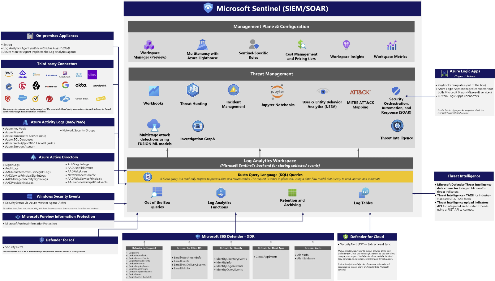

# Mission Enclave Sentinel Starter

The Mission Enclave Sentinel Starter Terraform module provides an opinionated approach for deploying and managing the core platform capabilities of Azure Sentinel using Terraform, with a focus on the central resource hierarchy.

## Architecture

## Design areas

The Mission Enclave Sentinel Starter Terraform module is designed to address the following areas:

[Resource organization](https://learn.microsoft.com/azure/cloud-adoption-framework/ready/landing-zone/design-area/resource-org)

- Create a management group hierarchy for the Sentinel platform

[Identity and access management](https://learn.microsoft.com/azure/cloud-adoption-framework/ready/landing-zone/design-area/identity-access)

- Azure Active Directory tenant for the Sentinel platform

[Security](https://learn.microsoft.com/azure/cloud-adoption-framework/ready/landing-zone/design-area/security)

- Enable Azure Security Center and Azure Defender for the Sentinel platform
