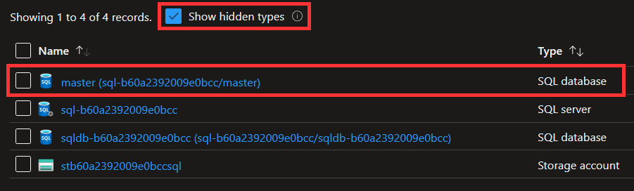

# Developing Terraform modules in Azure NoOps

This document provides best practices for developing reusable Terraform modules in Azure NoOps.

## Repository

- Use [this template](https://github.com/azurenoops/terraform-module-overlays-template) when creating your repository.

- Use the common naming convention `terraform-azurerm-overlays-<name>` when naming your repository.

    For example, if you want to create a module named `storage`, the repository should be named `terraform-azurerm-overlays-storage`.

- Configure the following code owners in a file `.github/CODEOWNERS`:

    ```raw
    * @azurenoops/code-reviewers
    ```

## Roles and scope

- Use resources that do not require more than `Contributor` role at the resource group scope.
  If you need to use a higher role, create an example instead.

## Hidden resources

- Don't create resources that are automatically created by Azure, e.g. hidden resources such as the `master` database for an Azure SQL server:

  